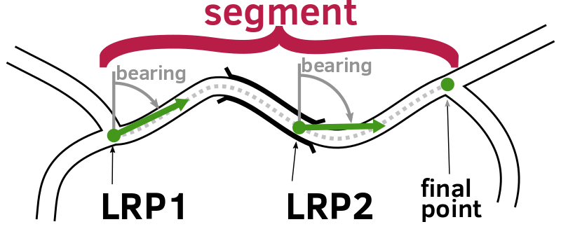
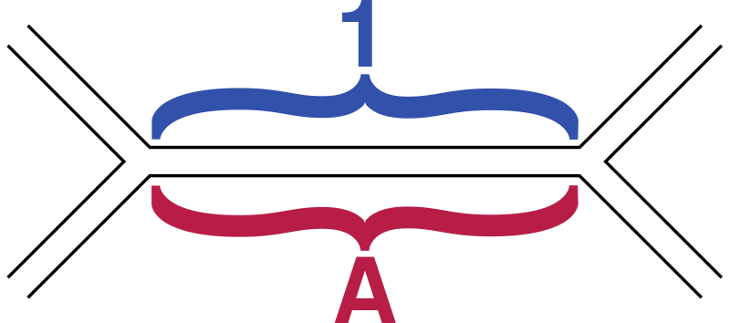
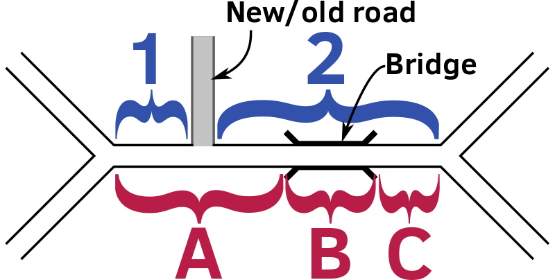

# Introduction to OSMLR

## What's the problem we're trying to solve?

As part of the [OpenTraffic](http://opentraffic.io/) project, we are trying to build an open and accessible traffic framework for global use which allows individuals and fleet operators to get the benefits of access to traffic data while participating in a transparent and privacy-respecting system.

At its core, traffic data is all about current or average speeds along a section of road. Specifying speed is easy, once a choice of units has been made, but specifying a section of road is more complex. There are many reasons for this:

* We are using data from [OpenStreetMap](https://www.openstreetmap.org), which provides a detailed, global road network with the same position on openness and accessibility that OpenTraffic aspires to. However, the OpenStreetMap (abbreviated to OSM) data is constantly updated as myriad people around the world contribute to it every minute of the day. While it would be possible for OpenTraffic to follow the same approach, we felt that there were benefits to having a slower, more controlled update process.
* Although we are using data from OSM, many individuals and fleet operators who wish to contribute to the project may want to use their own local datasets, and we want to make it possible for them to be part of OpenTraffic. This means that, although we construct our references to road sections from OSM data, it should be possible to find the section of road on a different map.
* Different datasets have different methods of splitting up roads into smaller parts, often to satisfy different requirements about their data model. For specifying traffic data, there is a balance between making road segments as long as possible to decrease the space that traffic data takes up, and making road segments shorter to increase the level of detail in the data. Getting this right for OpenTraffic will require a different method of splitting up roads than any other dataset has chosen.
* To keep data usage to a minimum, which may be important for sending traffic data to mobile devices, we want OSMLR descriptors and identifiers to be compact.

There are additional challenges discussed in this thread about [architecture](https://github.com/opentraffic/architecture/issues/1).

## How does OSMLR solve the problem?

To specify a section of road, OSMLR describes it as a series of "Location Reference Points" (LRPs) plus a final coordinate. Each LRP contains information about the road at that point and along to the next LRP, which help to uniquely identify the road section. The LRPs can be quite widely spaced as long as the route between two LRPs is uniquely identified by the endpoints and the properties attached to the LRP.

Those properties are:

* Bearing along the road from the LRP. Specifically, this is taken as the bearing from the LRP to the point 20m along the road from the LRP in the direction of the next coordinate. This helps to find the right section of road at junctions where many sections may start.
* Road class at the LRP. This helps to identify which of several roads meeting at a point, or flying over or under each other, is intended by the descriptor.
* "Form of Way" at the LRP. This also helps to identify the particular road which is referred to from the potentially many which might be found at a given point.
* Least road class between the LRP and the next coordinate. This tries to reduce ambiguity if multiple paths exist between the LRP and the next coordinate. For example, if the shortest path between the LRP and the next coordinate takes a detour away from the highway, but the least road class is set to highway, then we know that we must adjust the path.
* Length of the road between the LRP and the next coordinate. This avoids matching long detours if roads are missing in the dataset being matched to.

To illustrate, consider the following fictional section of road.

In this example, we want to turn the contiguous section of road between the two junctions, which includes a section of bridge, into an OSMLR segment. However, because the bit of road which is a bridge has different properties, this means that there will be (at least) three OSM ways.

We need to merge across these ways to make up the whole segment. Once that segment has been identified, we need to compute the descriptor, which is the series of LRPs that describe it.

The LRPs are not aligned with the ways, and do not make reference to them. For each LRP, the properties are calculated along the geometry of the combined segment. In this example, there are two LRPs, which is not really to scale as LRPs only need to be repeated every 15km.

The whole descriptor might be:

1. First LRP coordinates.
  * Bearing: 60 degrees.
  * Road class: Residential.
  * Form of way: Single carriageway.
  * Least road class: Residential.
  * Length: 50m.
2. Second LRP coordinates.
  * Bearing: 90 degrees.
  * Road class: Residential.
  * Form of way: Single carriageway.
  * Least road class: Residential.
  * Length: 40m.
3. Final point coordinates (with no properties).

This OSMLR descriptor is given an ID consisting of three parts:

1. The "level" of the segment. This is calculated from the road class of the first LRP, with motorways, trunk and primary roads in level 0, secondary and tertiary in level 1 and all other roads in level 2.
2. The tile in which tile segment begins. Tile numbers are calculated as array indexes into a 2D array with the lower left at 0,0 = 0 and the lower right at x,0 = x, with the tile 1,0 = x+1. Tile sizes are 4 degrees on a side for level 0, 1 degree for level 1 and a quarter degree for level 2.
3. The ID within each tile. These are assigned to keep maximum compatibility between successive generations of data releases, such that each ID is immutable (only ever refers to a constant value of descriptor) although they may be marked as deleted if superseded in later data releases.

## Relationship to OpenLR

These problems have already been faced and a solution found by the [OpenLR](http://openlr.net/) project. Although OpenLR deals with many kinds of location references, OpenTraffic only needs to specify linear references - i.e: sections of roads.

Therefore, the scheme described above is based on OpenLR with changes where appropriate to make it easier to work with OSM data.

## Relationship to Valhalla

[Valhalla](https://github.com/valhalla/valhalla) is an open source routing engine and accompanying libraries for use with OpenStreetMap data. Valhalla also includes many routing-related tools, such as time-distance matrix computation, isochrones, elevation sampling, map matching and tour optimization (Traveling Salesman).

While the OSMLR model could be implemented independent from Valhalla, re-using existing, tested code to build the OSMLR segment generator reduces the size of the OSMLR codebase and makes it quicker and less error-prone to write. Since Valhalla is open source, there is little downside to introducing this dependency.

## Creating OSMLR descriptors

This software, `osmlr`, creates OSMLR descriptors from Valhalla road data tiles. It starts by merging across adjacent Valhalla graph edges which distinguish properties which are important to Valhalla's routing algorithms, but not to the collection of traffic data. For example, Valhalla keeps separate edges for bridges and tunnels as these can have important restrictions for traffic. However, since the start of a bridge or tunnel does not represent a point at which the driver of a vehicle has choice - if there is no junction - then for traffic purposes it can be counted as the same section of road.

For each merged sequence of edges, OSMLR will calculate the descriptor and output it in a tile. Calculating the descriptor involves splitting up the merged sequence into a set of LRPs such that the distance between neighbouring LRPs is at most 15km. The properties are then calculated at each LRP, and stored in the descriptor.

Making sure that descriptors match only a single road is important, but currently unimplemented. This would mean matching the descriptor back to the road network and checking that it matched the original edges. Further, it is important to be _more_ specific than necessary for the input dataset, as there may be differences between the input dataset from OSM and the same area at a later date, or a different source of data.

## OSMLR descriptor packaging and distribution

OSMLR [descriptors](https://github.com/opentraffic/osmlr-tile-spec/blob/master/segment.proto) are packaged into separate levels of [tiles](https://github.com/opentraffic/osmlr-tile-spec/blob/master/tile.proto), just like Valhalla road data tiles, which means that users can download only the subset of the data that they need. The descriptors and tiles are described in a [Google Protocol Buffers description](https://github.com/opentraffic/osmlr-tile-spec/). This makes the output files relatively compact, gives a clear path for upgrades to the format and makes it easier to construct tools and libraries to access that data from many different programming languages.

Keeping OSMLR IDs compact is important, as these IDs are used in many places to look up traffic data or to keep correspondences between datasets. To ensure that OSMLR IDs are compact while allowing for them to change over time, OSMLR IDs are assigned by a central process. When an updated set of OSMLR descriptors is wanted, the central process will match the previous set of descriptors against the new data and retain any which still match. This means that new IDs are only assigned to new roads, or ones which have undergone major changes. For major changes, the old IDs are marked as "deleted" so that the association between a road section and an OSMLR descriptor is kept unique for any given data release.

## Matching OSMLR descriptors to a map dataset

OSMLR descriptors can be matched to a map dataset by taking the LRPs in each descriptor and making a shortest-distance route from each to the next coordinate, biasing in favour of routes which head in the right bearing. If several routes are candidates, then choose the one which most closesly matches the descriptor.

This can be somewhat fuzzy, and there may be more than one match. In these cases, it may require some tie-breaking to figure out which is the best match. Descriptors may not overlap, so it's possible to discard any part of the road network which was already matched to a descriptor. Indeed, descriptors which do not have a good candidate match - or have several - might be best postponed until all other good matches have been made to reduce the number of candidates. In general, a more major road such as a highway would make a better match than a residential road, but the circumstances may vary with the characteristics of the individual dataset.

Many of the descriptors will not be fuzzy, and will closely match a single segment of road. In these cases, optimisations are possible so as to not need to run a full route for each match. Running a route can sometimes be expensive in computer time, so avoiding it whenever possible is recommended.

The first case for optimisation is when the target dataset has an edge in its routing network which corresponds exactly to the descriptor. These can be found easily when the source and destination points are the start and end nodes of an edge in the graph. While this may lead to spurious matches where there is also a shorter route, we rely on the extra attributes in the OSMLR descriptor - the bearing, length, road class, and so forth - to filter these out and ensure that only valid matches will be found.

This case can be extended for a sequence of edges. The edges leaving the start node can be "walked" to the next edges until either the end node is found, or a junction is encountered. Again, we rely on the properties of the descriptor to find candidate edges and filter out spurious matches.

It is possible that several edges will match one descriptor, or that a single descriptor might only match a part of an edge. We call such collections of edges and descriptors "chunks". Each chunk consists of multiple edges, each of which has several correspondences to ranges along some descriptors. A single edge might match the first 50% of its length to one descriptor and the remaining 50% to a different one, for example.

After the matching process is complete, this association between edges and OSMLR descriptors is saved to a data structure which handles both the common 1:1 match in a compact and efficient manner, but also allows for the more complex chunks. This consists of an array of OSMLR IDs indexed by the edge ID within a tile. There are some flag bits stored along with the OSMLR IDs which determine whether it is treated as a single ID for the common 1:1 case, or as an index into a second array of objects which describe the details of the chunk.

### Different types of matches

#### One to One

The one-to-one match is the simplest case, and happily also the most common. In this case, there is one OSMLR segment describing a single graph edge in the map - whether that be an OSM way, Valhalla edge or data item from another map data source. This is illustrated below.

The OSMLR descriptor and the road in the datasource overlap to within a tolerance. They start at similar points and end at similar points, and pass through similar points. The degree of tolerance that is used in the Valhalla matching process is 10 meters, although other values can be used depending on the particular circumstances of the dataset.

Given the 1:1 correspondance, it's easy to transfer properties - such as traffic speeds - from edges to OSMLR segments and vice-versa.

#### One to Many

In this case, one OSMLR segment describes several edges in the routing graph. This most commonly happens when an OSMLR segment elides a road feature which is unimportant for traffic purposes, such as a bridge.

Although the edges partially overlap, the combination of the edges is equivalent to the OSMLR segment. The first node of the first edge matches the start of the OSMLR segment descriptor and the last node of the last segment matches the end of the OSMLR segment descriptor.

Transferring properties, such as traffic speed, from the descriptor to the edges might be as simple as assigning the same value to all of them. Transferring properties in reverse might require averaging, possibly with a length weighting.

#### Many to One

In this case, several OSMLR segments describe the same edges, although non-overlapping parts of it. This can happen when the data that the routing graph was generated from is different from the data used to generate the OSMLR segments. In the illustration below, this is represented by a road that has been added or deleted between the datasets such that it was present when the OSMLR descriptors were generated, and missing when the routing graph was generated.

Each OSMLR descriptor matches only part of an edge, but the combination of all the descriptors matches the edge. The start of the first segment matches the first node, and the end of the last segment matches the end node.

Transferring properties is the inverse of the one-to-many case; going from the segments to the edge, one may want to do an average, weighted by length. When transferring from the edge to the segments, it may suffice to use the same value for all segments.

#### Many to Many

This case may arise out of a combination of the one-to-many and many-to-one cases, as illustrated below, or simply arise from complex differences between datasets. For the illustration, a road has been added or removed next to a bridge, and this means that the end points of the edge adjacent to the brige and the new road do not coincide.

One way of dealing with these is to define "chunks", with each chunk consisting of segments 1 and 2, plus edges A, B and C. While the interior points (betwen 1 & 2, or between A & B or B & C) are not shared between edges and segments, the start point of the chunk is shared between 1 & A, and the end point between 2 & C. This allows a linear reference along the whole length of the combined chunk, and so allows properties to be linearly interpolated, weighting by length.
